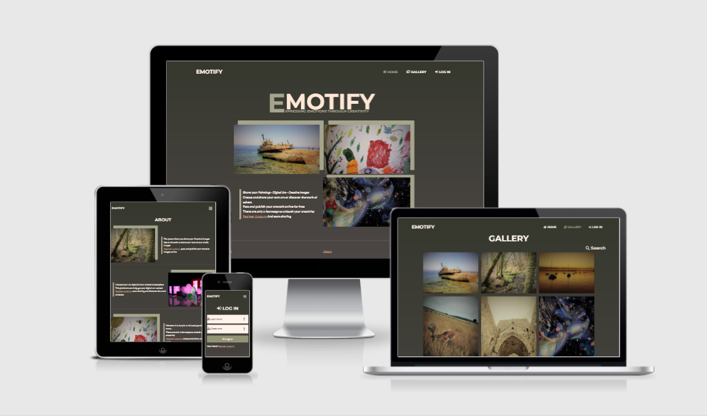
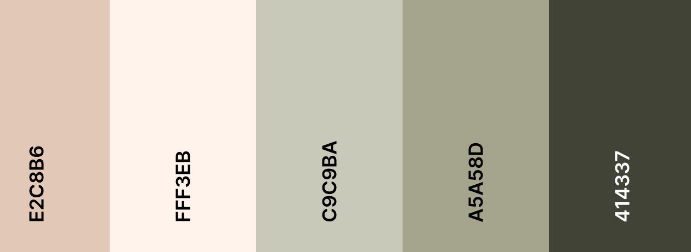
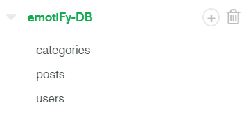
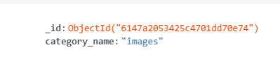
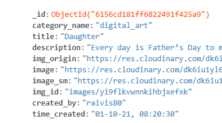
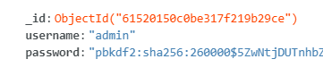
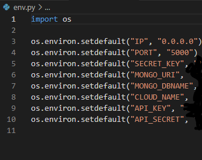
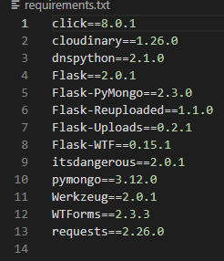

# EmotiFy

## [View the live project here.](https://emotify-ms-3.herokuapp.com/)

### Table of contents

1. [Introduction](#EmotiFy)
1. [Ux](#UX)
   - [User Stories](#User-Stories)
   - [Site owner goals](#Site-owner-goals)
1. [Development Planes](#Development-Planes)
   - [Strategy](#Strategy)
   - [Scope](#Scope)
   - [Structure](#Structure)
1. [Wireframes](#Wireframes)
1. [Design](#Design)
1. [Features](#Features)
1. [Testing](#project_files/TESTING.md)
   - [TESTING.md](project_files/TESTING.md)
   - [Bugs TESTING.md](project_files/TESTING.md#Bugs)
   - [W3C-Validation TESTING.md](project_files/TESTING.md#Validation)   
1. [Technologies and Frameworks](#Technologies-and-Frameworks)
1. [Deployment](#Deployment)
   - [Fork A repository](#Fork-A-repository)
   - [Creating a Clone Deploy Locally](#Creating-a-Clone-Deploy-Locally)
   - [Deploying on Heroku Pages](#Deploying-on-Heroku-Pages)
1. [Credits](#Credits)

# [&#8686;](#EmotiFy)
## ***Introduction***

### **Backend Development**

This is my third of four Milestone Projects that the developer must complete during Full Stack Web Development Program at The Code Institute. 
In this project, I will build a full-stack site which allow users to create, read, update and delete (CRUD) data. The Web application I'm building for this project is: Digital art sharing app. Users will share their unique, interesting pictures, paintings or digital art.
### **Main Technologies**

Required: HTML, CSS, JavaScript, Python+Flask, MongoDB. Additional libraries and external APIs

### **Mandatory Requirements**

Data handling: Build a MongoDB-backed Flask project for a web application that allows users to store and manipulate data records. 
Database structure: design a database structure well-suited for the domain.
User functionality: Create functionality create, locate, display, edit and delete records (CRUD functionality).
Use of technologies: Use HTML and custom CSS for the website's front-end.
Structure: Incorporate a main navigation menu and structured layout.
Documentation: Write a README file.
Version control: Use Git & GitHub for version control.
Deployment: Deploy the final version of your code to a Heroku.


# [&#8686;](#EmotiFy)
## ***UX*** 
### **User Stories**
 User goals
- As a user, I want to be able to access site on various devices such us mobile, tablet or pc.
- As a user, I want to easily understand the main purpose of the site.
- As a user, I wSant to be able to easily navigate throughout the site to find desired content.
- I also want to locate their social media links.
- I want to get in contact with the owner if any questions or bugs I may have.

As Registered user
- I want to be able to create my own account.
- I want to to be able to upload and share Interesting content with others.
- I want Find people with similar interests and mindsets.
- I want to be able to edit/delete my content if needed.
- i Want to be able to edit/delete my account details.

As an Administrator
- all the above and
- As an Administrator, I want to monitor and manage content.
- And as an Administrator, I want to manage user access and profile data.

#### Site owner goals
- As a Site owner, I want to Provide potential users with online Digital Art content sharing platform.
- As a Site owner, I want to Provide everyone who visits the site to have a good user experience.
- As a Site owner, I want to Provide user with easy site navigation and search options.
- As a Site owner, I want to to enable registered users to quickly and easily. share their content.
- As a Site owner, I want to Build trust with customers - providing with social media links.
- As a Site owner, I want to provide user with customer Support to Improve customer satisfaction through better service.
# [&#8686;](#EmotiFy)
## ***Development Planes***
### **Strategy**
#### The website needs to enable the User to:
- Effortlessly navigate site and find content.
- Log-In and Create account.
- Update edit/delete their account.
- Upload, delete, edit and share content.
- Find Website owner on their preferred social media platform.
- Contact Administrator if any issue or bug.

#### The website needs to enable the company to:
- Provide user with simple user friendly interface.
- Provide a good site navigation to easy and quickly find the relevant content.
- Provide user and admin interfaces with ability to add content to the site
- Provide content sharing platform to share with other users.
- Provide Interface For users to create, edit and delete content.
- Implement content CRUD a persistent storage application: create, read, update and delete.
- Stay connected with customers by providing social media links for any suggestions.
- Implement review section for users to be able to rate artwork and leave text response or likes.

# [&#8686;](#EmotiFy)
### **Scope**
Features to implement in terms of viability/feasibility. Below is a Dot Plot chart consisting of data points plotted on a scale of 1 represents least and 5 the most.
[Line-plots](project_files/wireframes/line-plots.png)
#### Functionality Requirements
- Template.
   - Bootstrap starter template used to kick start the project
   - Flask structure in each template, each template will extend a base template
- Website Navigation with internal site links.
   - Internal lins is Linked with Jinja Special placeholders in the template 
   - Responsive bootstrap website navigation
- Registration/Log-In Form.
   - Database integration user management
   - Form validation implementation
   - Username between 5 and 15 characters
   - Password between 5 and 10 characters
   - Confirm to match the password field
- Recent photo upload gallery feature.
   - Pulled from User uploads, most recent display first
- User upload Thumbnail grid.
   - Cloudinary API integration for image content management and storage
   - Database integration store description and image links
   - Recent uploads showing first based on last uploaded content
- User management system with CRUD.
   - Enable user to create, read, update and delete content
- User management system with database integration.
   - Store user account information on MongoDB Atlas database
   - Manage user accounts by manipulating MongoDB database with Python
- Integrate Database for content management.
   - Content description and image links stored and managed on MongoDB Atlas database
   - Manage user content by manipulating MongoDB database with Python
   - Images are stored locally, image links along with description are stored in the database
- Customer Support contact form.
   - Javascript API form control implemented for this project
- Social Media links to external resources.
#### Content Requirements
- NavBar
   - Internal site navigation Links
   - Login/Register link
   - Site brand name 
- Sign In
   - In the "Username" field, enter a username
   - Enter and confirm your password
   - Click "Sign In" button
- Create account
   - In the "Username" field, enter a username
   - Enter and confirm your password
   - Enter email address.
   - Click "Create new account" button
- Landing Page
   - Central Hero image
   - Carousel recent uploads feature
- User upload Thumbnail grid
   - Displays user content in a responsive grid
- Contact Form
   - First and Last Name input fields
   - Email Address input field
   - Text area input field
   - Submit button
- My Posts
   - All users posts display card type grid
   - Individual Card feature image at the top
   - Title, and description bebow the image
   - Next at the bottom Buttons to delete and edit post details
   - Delete	Post button feature confirm function for to prevent accidental deletion
- Add New post
   - Image upload functionality
   - Title input field
   - Text area field for content description
   - Post content button
- Edit Post
   - Edit Title input field
   - Text area field to Edit content description
   - Edit content confirm button
- Account
   - Enter username input Field
   - Enter Password input Field
   - Confirm Check box
   - Finaly Sebmit to delete button
- Admin management Interface
   - Manage/delete self profile
   - Manage other User profile.
   - Image upload functionality, Title input field
   - Text area field for content description
   - Post content button, Edit content button
   - Edit/Delete	self/other user Posts
- footer
   - Copyright information
   - Terms and privacy policy
   - Social Links
     - FaceBook, LinkedIn, Instagram

# [&#8686;](#EmotiFy)

### **Structure**
### Site layout structure
[site-structure wireframe](project_files/wireframes/site-structure.png)

### Site structure broken into more detailed, structured view below
- Landing Page
   - NavBar
      - Sign In
         - Username
         - Password field
         - Login button
         - Link ro register
            - Loged in users
               - My Posts
               - Add New Post
               - Account
               - Log out
      - Create account
         - Username field
         - Password field
         - Create account button
         - Link to log in
      - Branding name + reload function
      - Links to external resources
         - To Facebook
         - To Instagram
         - To LinkedIn
   - Central Hero image
   - Carousel recent uploads feature
- Gallery
   - Grid based Bootstrap cards content container 
      - Image upper Content
      - Title
      - Description
- My Posts
   - Grid based Bootstrap cards content container 
      - Image
      - Title
      - Description
      - Edit post button
         - Edit new post
            - Edit Title input field
            - Text area field to Edit content description
            - Edit content confirm button
      - Delete post button
         - Delete Accoutt
            - Username field
            - Edit Password
            - Confirm
            - Delete Button
      - Add new post
         - Image upload field
         - Title input field
         - Text area field for content description
         - Post content button
- Admin management Interface
   - Edit other user profile
      - Delete account
      - Reset password
      - Delete/Edit/Update posts
- About Page
- footer
     - FaceBook, LinkedIn, Instagram, About

#### **Wireframes**
- ### [landing page wireframe](project_files/wireframes/landing-wireframe.png)

- ### [Gallery wireframe](project_files/wireframes/gallery.png)

- ### [Profile wireframe](project_files/wireframes/profile.png)

   *Design change for finale project "Profile" User interface.*

   Added Individual post card grid arranged based on recent first
   And Added Buttons for edit and delete options
   Original wireframe version for user interface can be found [Here](project_files/wireframes/interface.png)

- ### [Add New Post wireframe](project_files/wireframes/add-post.png)

   *Add new post Dedicated interface was added later in the project to better suit project purpose*

- ### [User Account wireframe](project_files/wireframes/account.png)
   *One more redesign feature was added later in the project*

   Added user account page to enable users to be able to delete their account if they wish so.


- ### [DB structure wireframe](project_files/wireframes/db-structure.png)

   *significant changes was made for elements in DB structure to meet site purpouse and needs.*

   Start project Original DB structure wireframe [db structure here](project_files/wireframes/mongoDB-wireframe1.png)


# [&#8686;](#EmotiFy)
## ***Design***
### **Colour Scheme**
Color sheme used through out the site.

Thanks to [coolors.co](https://coolors.co)
### **Fonts**
- Headings h6,h5,h4,h3,h2,h1 family [ Montserrat](https://fonts.googleapis.com/css?family=Montserrat:400,700")
- Body main text font family [Lato](https://fonts.googleapis.com/css?family=Lato:400,700,400italic,700italic")  As a backup sans-serif.
### **Media**
Bootstrap ["Freelancer"](https://startbootstrap.com/theme/freelancer) starter template used for site modified to suit current project.

Template source code can be found by clicking following link > [GitHib](https://github.com/startbootstrap/startbootstrap-freelancer)

# [&#8686;](#-)
## ***Features***
The website built using a flask web framework and bootstrap framework. WTForms form librarie Integration with forms validation. The Website is fully responsive fixed navigation bar at the top. MongoDB Cloud data platform for databases cloud storage. Cloidinary API for Image assets management.### Mongo DB Features
### Mongo DB Layout
- In MongoDB, databases hold three collections of documents: "Categories", "posts" and "user" collection.<br>
 <br>
   - In "Categories" collection we have Group of 2 fields:  <br>
      - "_id: ObjectID"
      - "category_name" this field is unique for this reason it is used to index posts collection in the DB<br>
      
   - In "Categories" collection we have Group of 10 fields:
      - "_id: ObjectID" for post management "_id_" field is used for indexes and queries.<br>
      - "title" is not unique but is used for search function to query all the posts with same title.
      - "Description"
      - "iamge_origin" Full size image stored in the Cloudinary API user can view once clicked.
      - "image" 1920p image URL requested from Cloudinary API medium size thumbnails for site performance.
      - "image_sm" 300p image URL requested from Cloudinary API small thumbnails for site performance.
      - "image_id" field is unique and purpose for this ID is ability to delete iamge along with post content.
      - "created_by" unique field is primary keys used to query user posts by username.
      - "time_created" Time created<br>
    <br>
   - In "Categories" collection we have Group of 3 fields: 
      - "_id: ObjectID"
      - "username" field is unique for this reason it is used for user management<br>
      - "password" is Hashed and unique, establishes a user's authorization to access user interface and secure resources<br>
       <br>

### Site Features
- Sign In, Create account forms [Image](project_files/images/features/login.PNG)
   - Forms Features "Username", enter your password fields.
   - To help with form validation I.m using WTForms validation tools.
   - WTForm validation used that includes validations such as"Min/Max-Lenght", "Allowed Characters".
   - A new session cookie will be generated upon login.
- Create account forms [Image](project_files/images/features/register.PNG)
   - Forms Features "Username", enter and confirm your password fields.
   - create account will generate Hashed Passwords With Werkzeug and store along with username on a mongo DB users collection.
   - WTForm validation used that includes validations such as"Min/Max-Lenght", "Allowed Characters" and Confirm password.
- Landing Page [PC Image](project_files/images/features/index-pc.PNG), [mobile Image](project_files/images/features/index-mobile.PNG)
   - Large fully responsive website brand name heading.
   - Dynamic Image feature, displays latest user post inserts across three categories.
- NavBar [PC Image](project_files/images/features/navbar-desktop.PNG), [mobile Image](project_files/images/features/navbar-mobile.PNG)
   - The website features a fully responsive navbar with a dropdown menu.
   - Internal site navigation Links, Login/Register link, Site brand name.
- Thumbnail Gallery [PC Image](project_files/images/features/gallery-pc.PNG), [mobile Image](project_files/images/features/gallery.PNG)
   - Gallery Displays user content in a responsive grid thumbnails. Gallery order is displaying recent first.
   - Gallery is generated dynamically using flask jinja2 a templating language for loop.
   - All the text content and image links are stored on a Mongo DB.
   - And all the image files are stored on a API cloud service "Cloudinary".
   - Each Thumbnail has link that if clicked on will open up a modal with larger version of the image, description and author.
   - Modal image link future more to secure cloudinary URL. [modal Image](project_files/images/features/gallery-modal.PNG) 
- About Page [PC Image](project_files/images/features/about-pc.PNG), [mobile Image](project_files/images/features/about.PNG) 
  - Features three latest, shared images from three different categories
  - Each category with description about sharing images, art and digital art.
  - Galery search function enables user to search by keyword, uasername or category name [Image](project_files/images/features/search-bar.PNG)
- My Posts [PC Image](project_files/images/features/my-osts-pc.PNG), [mobile Image](project_files/images/features/my-posts.PNG) 
   - My Posts Page Displays user content cards in a responsive grid. Post order is displaying recent first.
   - My Posts cards is generated dynamically using flask jinja2 a templating language for loop.
   - All the text content and image links are stored on a Mongo DB.
   - And all the image files are stored on a API cloud service "Cloudinary".
   - Each Card has a build in link that if clicked on will open up a Edit post page.
- Add Post [Image](project_files/images/features/add-post.PNG)
   - Category dropdown sellect meny, Title input field, text area field for content description, Image upload functionality, 
   - WTform validation used to verify allowed files such as Images. .jpg. .jpeg. .png. . gif ....
   - Once form was submitted, the Images are uploaded to the "cloudinary" API.
   - Three image links are generated out of cloudinary (300p small thumbnails, 1920p Larger thumbnails and full size image link)
   - Image links along with text content are stored in he Mongo DB posts collection.  
- Edit Post [Image](project_files/images/features/updaet-post.PNG)
   - Features Category dropdown sellect meny, Title input field, text area field for content description and delete button.
   - Edit post enables user to change post category, edit description and the title but not the image.
   - At The bottom of the form is a Delete Post button with confirm function for to prevent accidental deletion.
   - Delete function will wipe out all the content related to the post (")text and image links and with image files).
- Account  [Image](project_files/images/features/my-account.PNG)
   - Feature two bootstrap vertically collapsing accordions
      1. Change password [Image](project_files/images/features/change-password.PNG)
         - Old password, new password, confirm password fields with submit button
         - Cange passwors will erase old Hashed Werkzeug and generate new ghash based on password
         - Database user collection will update with new hash after submitting the form
      1. Delete account  [Image](project_files/images/features/change-password.PNG)
         - password, confirm password fields with submit for deletion button
         - All the user data will be removed from Mongo DB users collection
- Admin manage [Image](project_files/images/features/admin.PNG)
   - Feature bootstrap vertically collapsing accordions.
      1. Users And Posts [Image](project_files/images/features/change-password.PNG)
         - Total number of the users
         - Total number of the posts
         - All the registered users and their posts with links to the post itself.
      1. Resset DB Indexes [Image](project_files/images/features/user-posts-admin.PNG)
         - This Will drop all search indexes on a collection and recreates
         - Checbox following javascript function to prompt the user to confirm Before resset.
      1. Add new Category
         - Text input field for new category input and Submin button.
         - After submitting the new category will be created and stored in mongoDB categories collection.
      1. Delete Category
         - Dropdown caegory sellect meny Submin button.
         - After confirmation category will be deleted from mongoDB categories collection.
      1. Delete any user account [Image](project_files/images/features/delete-user.PNG)
         - Username fiel, password, confirm password fields with submit for deletion button
         - All the user data will be removed from Mongo DB users collection
      1. Change Admin password [Image](project_files/images/features/admin-pass.PNG)
         - Features, Old password, new password, confirm password fields with submit button
         - Cange passwors will erase old Hashed Werkzeug and generate new ghash based on password
         - Database user collection will update with new hash after submitting the form
- Admin section user posts [Image](project_files/images/features/admin-user-posts.PNG)
   - user Posts Page Displays user content cards in a responsive grid. Post order is displaying recent first.
   - User Posts cards is generated dynamically using flask jinja2 a templating language for loop.
   - All the text content and image links are stored on a Mongo DB.
   - And all the image files are stored on a API cloud service "Cloudinary".
   - Each Card has a build in link that if clicked on will open up a Edit post page.
   - Post search function enables admin to search by keyword, uasername or category name [Image](project_files/images/features/search-bar.PNG)
- Admin manage User posts [Image](project_files/images/features/manage-user-posts.PNG)
   - Features Category dropdown sellect meny, Title input field, text area field for content description and delete button.
   - Edit post enables user to change post category, edit description and the title but not the image.
   - At The bottom of the form is a Delete Post button with confirm function for to prevent accidental deletion.
   - Delete function will wipe out all the content related to the post (text and image links and with image files).
   - A link to delete user profile modal
- Delete user popup modal [Image](project_files/images/features/delete-user-modal.PNG)
   - Prefilled with Username of the post, password, confirm password fields with submit for deletion button.
   - All the user data will be removed from Mongo DB users collection.
- footer
   - Copyright information
   - Link to About page
   - Social Links
     - FaceBook, LinkedIn, Instagram

# [&#8686;](#EmotiFy)
## [TESTING](project_files/TESTING.md)
- Testing information can be found in a separate testing file [TESTING.md](project_files/TESTING.md)
- Bugs and Issues moved to the TESTING file here [TESTING.md](project_files/TESTING.md#Bugs)
- W3C-Validation moved to the TESTING file here [TESTING.md](project_files/TESTING.md#Validation)  

# [&#8686;](#EmotiFy)
## **Technologies and Frameworks**

### **Markup/Scripting/Programming languages**
- [HTML5](https://en.wikipedia.org/wiki/HTML5) Hypertext Markup Language (HTML)
- [CSS3](https://en.wikipedia.org/wiki/Cascading_Style_Sheets) Cascading Style Sheets (CSS)
- [JavaScript](https://www.javascript.com/) Interactive functionality.
- [Python](https://en.wikipedia.org/wiki/Python_(programming_language)) Backend programming. 
- [Jinja templating language](https://jinja.palletsprojects.com/en/3.0.x/) Special placeholders in the template similar to Python syntax
### **Frameworks, Libraries & Programs Used**
- [Google Fonts:](https://fonts.google.com/) Making the web more beautiful.
- [Font Awesome:](https://fontawesome.com/) to add icons to the website..
- [Git](https://git-scm.com/) Git was used for version control.
- [GitHub:](https://github.com/) used to store the projects code.
- [gitpod.io](https://gitpod.io/) gitpod Was used for codding.
- [VS Code](https://code.visualstudio.com/) gitpod Was used for codding.
- [Balsamiq:](https://balsamiq.com/) was used to create the wireframes.
- [Flask](https://flask.palletsprojects.com/en/2.0.x/patterns/jquery/) Framework for rendering pages.
- [MongoDB](https://www.mongodb.com/) NoSQL database back-end data storage.
- [Heroku](https://heroku.com/) Application hosting platform.
- [cloudinary](https://cloudinary.com/) Image cloud storage and management API 

# [&#8686;](#EmotiFy)
## ***Deployment***
Sources:

https://docs.github.com/

https://docs.mongodb.com/

https://devcenter.heroku.com/categories/deployment
### **Fork A repository**
A Fork is a copy of repository allows you to freely experiment with changes without effecting the original project.

- Log-Into [GitHub](https://github.com/login "Link to GitHub login page") or [create an account](https://github.com/join "Link to GitHub create account page").
- Locate the [GitHub Repository](https://github.com/Raivis80/Milestone-Project-3)"Link to GitHub Repo".
- On GitHub, navigate to The [GitHub Repository](https://github.com/Raivis80/Milestone-Project-3)" Link to my Repo".
- In the --right corner of the page, click Fork.

Detailed Steps for forking a repository from GitHub can be found here: [here](https://docs.github.com/en/get-started/quickstart/fork-a-repo)
### **Creating a Clone Deploy Locally**
You can clone repository. When you clone repository, you copy repository to your Machine.
- Log-Into [GitHub](https://github.com/login "Link to GitHub login page") or [create an account](https://github.com/join "Link to GitHub create account page").
- Locate the [GitHub Repository](https://github.com/Raivis80/Milestone-Project-3)"Link to GitHub Repo".
- In the GitHub repository, navigate to the Code dropdown tab.
- Select the Download ZIP from dropdown and unzip in your working directory
   Or clone repository in terminal copy and paste following GitHubCLI link

   ```
   gh repo clone Raivis80/Milestone-Project-3
   ```
- Run following command to install python packages are required to run this project requirements.txt 

   ```
   python -m pip -r requirements.txt
   ```
- SignIn/Create free MongoDB Atlas Database account
   - Create Database for this project named "emotiFy-DB" with following collections

   | Collection Name |
   | ---------- |
   | 1.  Categories |
   | 2.  Posts     |
   | 3.  Users      |

- Create env.py protect your passwords using environment variables while connecting to databases with Python. File should contain following.




- Replace The SECRET_KEY with your own and MONGO_URI and CLOUDINARY_URL provided by mongoDB.
Ensure to add env.py to a .gitignore file before pushing your code to your repository.

<br>Detailed Steps for cloning a repository from GitHub can be found here: [here](https://docs.github.com/en/free-pro-team@latest/github/creating-cloning-and-archiving-repositories/cloning-a-repository)
 "Link to GitHub docs"
<br>Detailed guides to get Started with MongoDB can be found [Here](https://docs.mongodb.com/)

### **Deploying on Heroku Pages**
- After Cloning the repository now you are able to deploy on Heroku pages
- Before deployment Make sure to:
    - Create requirements.txt file in the same project directory use the following command

   ```
   pip freeze > requirements.txt
   ```

   

    - Create a Procfile in same directory that is required for all Heroku applications. to start the app. Enter Following in procfile.

   ```
   web: python app.py
   ```
- Log-Into [Heroku](https://id.heroku.com/login) "Link to Heroku login page" or [create an account](https://signup.heroku.com/login) "Link to Heroku create account page".
- Once logged in, Find and select "Deploy" tab 
- After selecting "Deploy" tab find and Select Deployment method "GitHub"
- Now find and Select Connect to GitHub repository and select repository to connect to
- Now locate and select option and enable "Automattic Deploys"
- You can now select "Deploy Branch"
- After you have deployed, go on top of the page and locate settings tab and select it
- Select within settings page "Reveal Config Vars and add following

| Config|	Vars |
| -- | -- |
| IP | 0.0.0.0 |
| PORT |	5000 |
| CLOUD_NAME | Cloudinary cloud name |
| API_KEY | Your Cloudinary API key |
| API_SECRET | Your Cloudinary secret key|
| SECRET_KEY |	Your secret key |
| MONGO_URI |	Your Mongo Uri |

Make sure to enter your own SECRET_KEY, MONGO_URI and CLOUDINARY_URL variables.

More Detailed information on GitHub Pages can be found here: [here](https://devcenter.heroku.com/categories/deployment) "Link to Heroku deployment docs"
# [&#8686;](#EmotiFy)
## ***Credits***
### **Code**

At the beginning of this project I was referring back to code institute Mini Project | Putting It All Together videos series for general python technical code instructions.
Some of the code syntax help and code tips sourced from following sources.
-  [Crack Concepts regex tutoral](https://www.youtube.com/watch?v=9RksQ5YT7FM) Watch one video and understand everything about REGEX with examples.
-  [flask.palletsprojects.com](https://flask.palletsprojects.com/en/2.0.x/) Tutorials that shows how to create a small application with Flask
-  [Validation with WTForms](https://flask.palletsprojects.com/en/2.0.x/patterns/wtforms/) Form Validation with WTForms
-  [FileField provided by Flask-WTF](https://flask-wtf.readthedocs.io/en/0.15.x/form/#file-uploads) The FileField provided by Flask-WTF File Upload
- [pymongo.readthedocs.io](https://pymongo.readthedocs.io/en/stable/tutorial.html) introductions to working with MongoDB and PyMongo.
- [cloudinary.com](https://cloudinary.com/documentation/image_upload_api_reference) Cloudinar API uploading and managing media assets in the cloud.
-  [stackoverflow.com](https://stackoverflow.com/): Useful website for code tips.
-  [www.w3schools](https://www.w3schools.com/): Useful website for code tips.

### **Content**
Bootstrap ["Freelancer"](https://startbootstrap.com/theme/freelancer) starter template used for site      modified to suit current project.
Template source code can be found by clicking following link > [GitHib](https://github.com/startbootstrap/startbootstrap-freelancer)

1. Start Bootstrap was created by and is maintained by **[David Miller](https://davidmiller.io/)**.

   - <https://davidmiller.io>
   - <https://twitter.com/davidmillerhere>
   - <https://github.com/davidtmiller>

1. Ship description content 
https://mycyprustravel.com/the-story-behind-the-paphos-shipwrecks/
1. Forest image qote - Chris Maser.
“What we are doing to the forests of the world is but a mirror reflection of what we are doing to ourselves and to one another.”
1. The rock of Cahel description
 https://castles.today/castles/castles/ireland/cashel/history/
1. Deer image descripton quote -Paul Oxton..
"No matter how few possessions you own or how little money you have, loving wildlife and nature will make you rich beyond measure." 
1. Brightest stars image description - Sarah Williams, Poet
"Though my soul may set in darkness, it will rise in perfect light; I have loved the stars too fondly to be fearful of the night."
1. Daughter image description - Saquon Barkley
Every day is Father’s Day to me when I’m with her: when I’ll be able to hold my daughter and see her grow and see her smile. That’s Father’s Day to me every day.


### **Acknowledgements**
- Thanks to My Mentor Owonikoko Oluwaseun, for continuous support and inspire me to push myself beyond where I think I can go.
- Tutor support at Code Institute for their support.

# [&#8686;](#EmotiFy)
