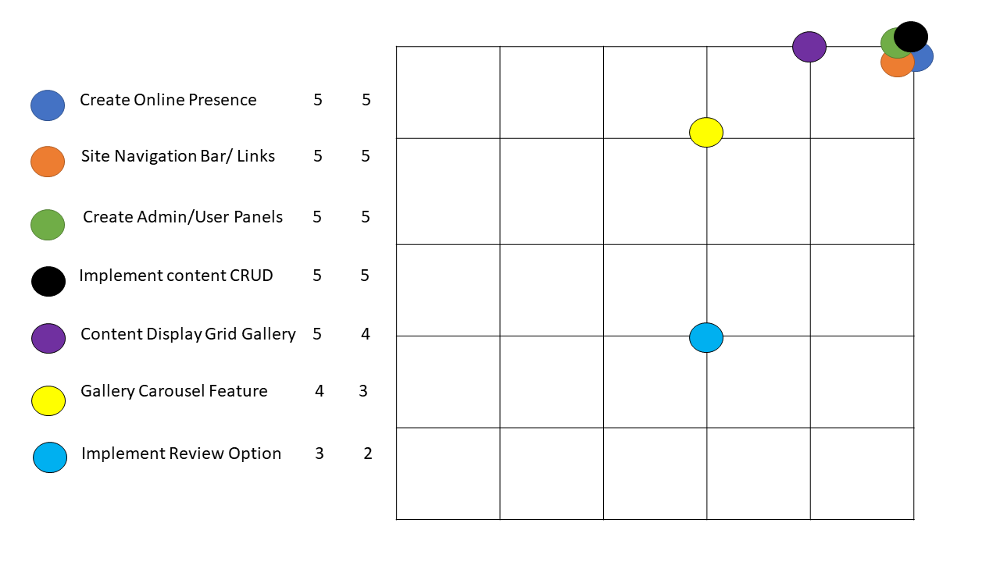
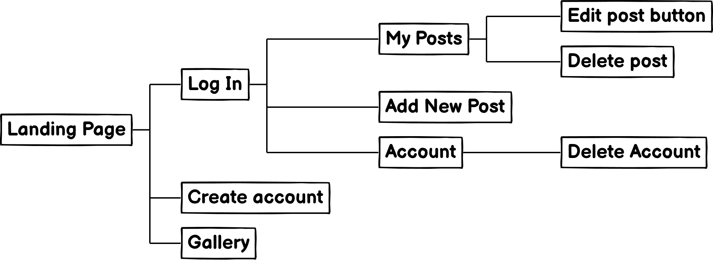
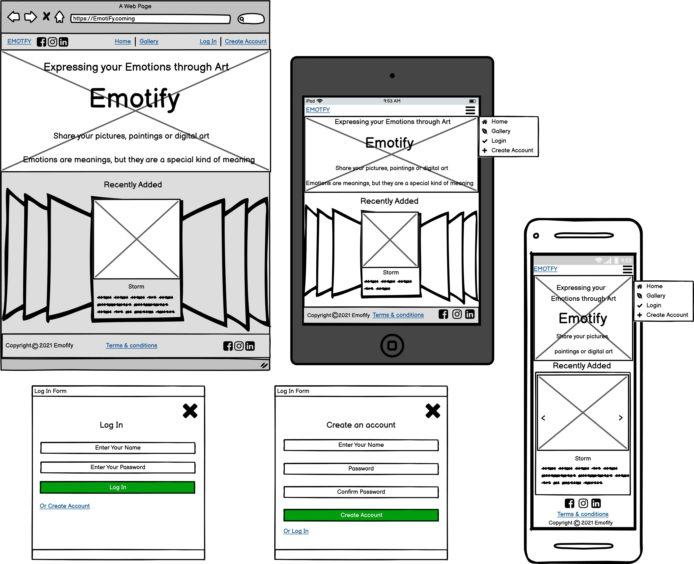
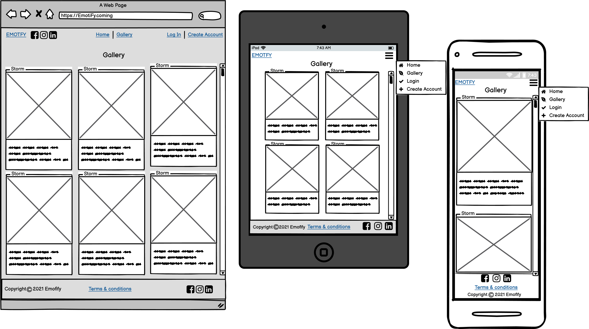
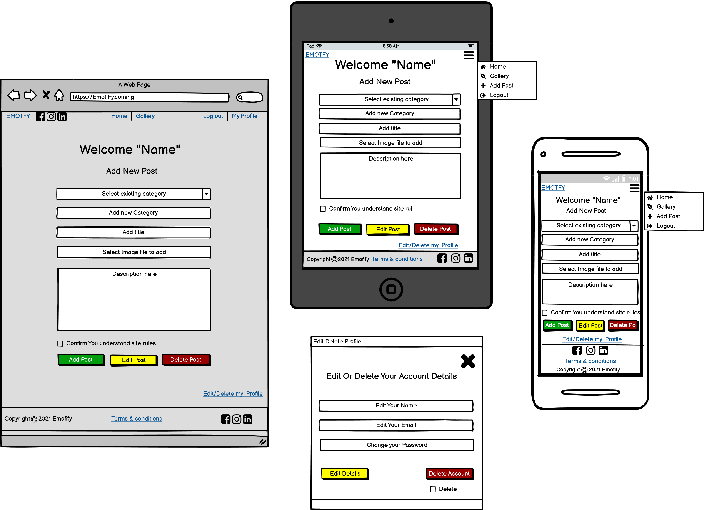
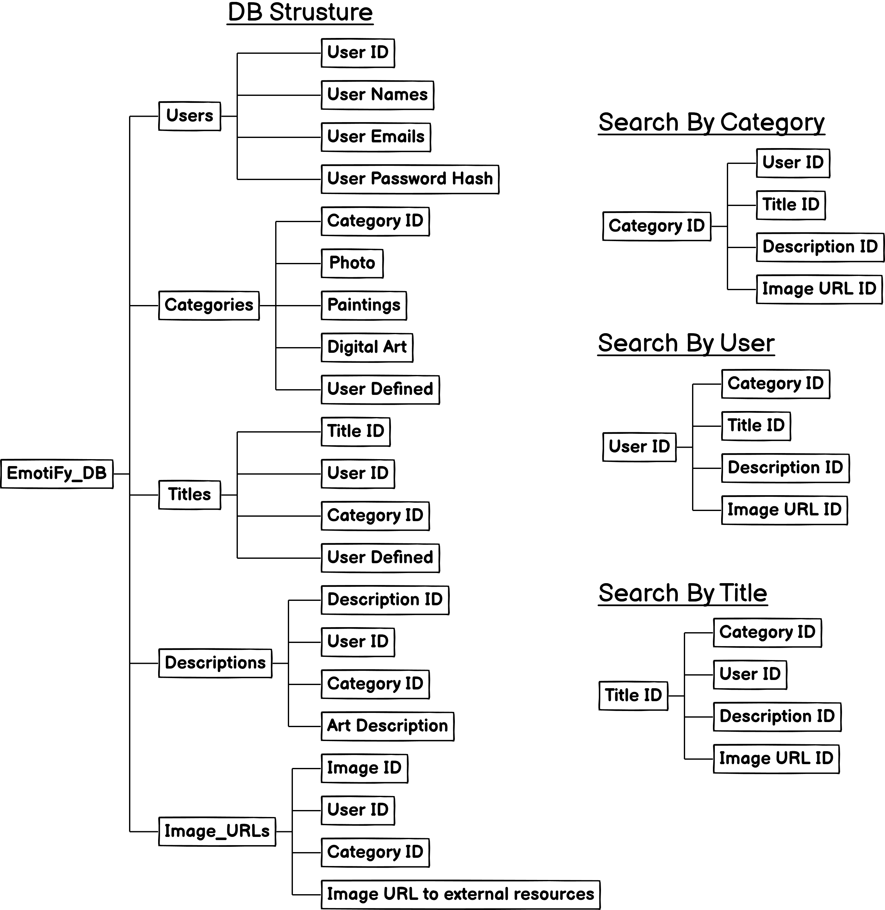

# EmotiFy
## [View the live project here.](https://raivis80.github.io)

# [&#8686;](#Introduction)
## ***Introduction***

### **Backend Development**

This is my third of four Milestone Projects that the developer must complete during Full Stack Web Development Program at The Code Institute. 
In this project, I will build a full-stack site which allow users to create, read, update and delete (CRUD) data. The Web application I'm building for this project is: Digital art sharing app. Users will share their unique, interesting pictures, paintings or digital art. Describing a specific meaning or generates emotions.
### **Main Technologies**

Required: HTML, CSS, JavaScript, Python+Flask, MongoDB. Additional libraries and external APIs

### **Mandatory Requirements**

Data handling: Build a MongoDB-backed Flask project for a web application that allows users to store and manipulate data records. 
Database structure: design a database structure well-suited for the domain.
User functionality: Create functionality create, locate, display, edit and delete records (CRUD functionality).
Use of technologies: Use HTML and custom CSS for the website's front-end.
Structure: Incorporate a main navigation menu and structured layout.
Documentation: Write a README file.
Version control: Use Git & GitHub for version control.
Deployment: Deploy the final version of your code to a Heroku.


# [&#8686;](#Introduction)
## ***UX*** 
### **User Stories**
 User goals
- As a user, I want to be able to access site on various devices such us mobile, tablet or pc.
- As a user, I want to easily understand the main purpose of the site.
- As a user, I wSant to be able to easily navigate throughout the site to find desired content.
- I also want to locate their social media links.
- I want to get in contact with the owner if any questions or bugs I may have.

As Registered user
- I want to be able to create my own account.
- I want to to be able to upload and share Interesting content with others.
- I want to express my own emotions and to share them with others.
- I want Find people with similar interests and mindsets that you can connect with.
- I want to be able to edit/delete my content if needed.
- i Want to be able to edit/delete my account details.

As an Administrator
- all the above and
- As an Administrator, I want to monitor and manage content.
- And as an Administrator, I want to manage user access and profile data.

#### Site owner goals
- As a Site owner, I want to Provide potential users with online Digital Art content sharing platform.
- As a Site owner, I want to Provide everyone who visits the site to have a good user experience.
- As a Site owner, I want to Provide user with easy site navigation and search options.
- As a Site owner, I want to to enable registered users to quickly and easily. share their content.
- As a Site owner, I want to Build trust with customers - providing with social media links.
- As a Site owner, I want to provide user with customer Support to Improve customer satisfaction through better service.
# [&#8686;](#Introduction)
## ***Development Planes***
### **Strategy**
#### The website needs to enable the User to:
- Effortlessly navigate site and find content.
- Log-In and Create account.
- Update edit/delete their account.
- Upload, delete, edit and share content.
- Find Website owner on their preferred social media platform.
- Contact Administrator if any issue or bug.

#### The website needs to enable the company to:
- Provide user with simple user friendly interface.
- Provide a good site navigation to easy and quickly find the relevant content.
- Provide user and admin interfaces with ability to add content to the site
- Provide content sharing platform to share with other users.
- Provide Interface For users to create, edit and delete content.
- Implement content CRUD a persistent storage application: create, read, update and delete.
- Stay connected with customers by providing social media links for any suggestions.
- Implement review section for users to be able to rate artwork and leave text response or likes.

# [&#8686;](#Introduction)
### **Scope**
Features to implement in terms of viability/feasibility. Below is a Dot Plot chart consisting of data points plotted on a scale of 1 represents least and 5 the most.

#### Functionality Requirements
- Template.
   - Bootstrap starter template used to kick start the project
   - Flask structure in each template, each template will extend a base template
- Website Navigation with internal site links.
   - Internal lins is Linked with Jinja Special placeholders in the template 
   - Responsive bootstrap website navigation
- Registration/Log-In Form.
   - Database integration user management
   - Form validation implementation
   - Username between 5 and 15 characters
   - Password between 5 and 10 characters
   - Confirm to match the password field
- Recent photo upload gallery feature.
   - Pulled from User uploads, most recent display first
- User upload Thumbnail grid.
   - Cloudinary API integration for image content management and storage
   - Database integration store description and image links
   - Recent uploads showing first based on last uploaded content
- User management system with CRUD.
   - Enable user to create, read, update and delete content
- User management system with database integration.
   - Store user account information on MongoDB Atlas database
   - Manage user accounts by manipulating MongoDB database with Python
- Integrate Database for content management.
   - Content description and image links stored and managed on MongoDB Atlas database
   - Manage user content by manipulating MongoDB database with Python
   - Images are stored locally, image links along with description are stored in the database
- Customer Support contact form.
   - Javascript API form control implemented for this project
- Social Media links to external resources.
#### Content Requirements
- NavBar
   - Internal site navigation Links
   - Login/Register link
   - Site brand name 
- Sign In
   - In the "Username" field, enter a username
   - Enter and confirm your password
   - Click "Sign In" button
- Create account
   - In the "Username" field, enter a username
   - Enter and confirm your password
   - Enter email address.
   - Click "Create new account" button
- Landing Page
   - Central Hero image
   - Carousel recent uploads feature
- User upload Thumbnail grid
   - Displays user content in a responsive grid
- Contact Form
   - First and Last Name input fields
   - Email Address input field
   - Text area input field
   - Submit button 
- User Interface
   - Edit/delete this profile
   - Image upload functionality
   - Title input field
   - Text area field for content description
   - Post content button
   - Edit content button
   - Delete	Post button with confirm function for to prevent accidental deletion
- Admin management Interface
   - Manage/delete self profile
   - Manage other User profile information reset passwords.
   - Image upload functionality, Title input field
   - Text area field for content description
   - Post content button, Edit content button
   - Edit/Delete	self/other user Posts
- footer
   - Copyright information
   - Terms and privacy policy
   - Social Links
     - FaceBook, LinkedIn, Instagram

# [&#8686;](#Introduction)

### **Structure**
### Site layout structure


### Site structure broken into more detailed, structured view below
- Landing Page
   - NavBar
      - Sign In
         - Email field
         - Password field
         - Login button
      - Create account
         - Name field
         - Surname field
         - Email field
         - Password field
         - Create account button
      - Branding name + reload function
      - Links to external resources
         - To Facebook
         - To Instagram
         - To LinkedIn
   - Central Hero image
   - Carousel recent uploads feature
- User upload Thumbnail grid
   - Grid based Bootstrap cards content container 
      - Image upper Content
      - Title
      - Description
- Contact Form
   - Name field
   - Email field
   - Text area field
   - Submit Button
- User Interface
   - Edit user profile
      - Edit name
      - Edit Email
      - Edit Password
      - Delete self
   - Drag and drop image area
   - Description text area
   - Title input field
   - Add post Button
   - Edit post button
      - Edit Title
      - Edit Description
      - Edit/Change/Delete image
      - Delete Post
- Admin management Interface
   - Edit user profile
      - Edit name
      - Edit Email
      - Edit Password
      - Delete self
   - Edit other user profile
      - Delete account
      - Reset password
      - Delete/Edit/Update Other user posts
   - Drag and drop image area
   - Description text area
   - Title input field
   - Add post Button
   - Edit post button
      - Edit Title
      - Edit Description
      - Edit/Change/Delete image
      - Delete Post
- footer
     - FaceBook, LinkedIn, Instagram

#### **Wireframes**
### Landing Page wireframe

### Gallery wireframe



### User Interface Wireframe



### DataBase structure below



# [&#8686;](#Introduction)
## ***Design***
### **Colour Scheme**

### **Fonts**
-  
### **Media**
-  
# [&#8686;](#-)
## ***Features***

#### - **Contact page**
# [&#8686;](#Introduction)
## [TESTING](TESTING.md)
- Testing information can be found in a separate testing file [TESTING.md](TESTING.md)
- Bugs and Issues moved to the TESTING file here [TESTING.md](TESTING.md)
- W3C-Validation moved to the TESTING file here [TESTING.md](TESTING.md)  

# [&#8686;](#Introduction)
## **Technologies and Frameworks**

### **Markup/Scripting/Programming languages**
- [HTML5](https://en.wikipedia.org/wiki/HTML5) Hypertext Markup Language (HTML)
- [CSS3](https://en.wikipedia.org/wiki/Cascading_Style_Sheets) Cascading Style Sheets (CSS)
- [JavaScript](https://www.javascript.com/) Interactive functionality.
- [Python](https://en.wikipedia.org/wiki/Python_(programming_language)) Backend programming. 
- [Jinja templating language](https://jinja.palletsprojects.com/en/3.0.x/) Special placeholders in the template similar to Python syntax
### **Frameworks, Libraries & Programs Used**
- [Google Fonts:](https://fonts.google.com/) Making the web more beautiful.
- [Font Awesome:](https://fontawesome.com/) to add icons to the website..
- [Git](https://git-scm.com/) Git was used for version control.
- [GitHub:](https://github.com/) used to store the projects code.
- [gitpod.io](https://gitpod.io/) gitpod Was used for codding.
- [VS Code](https://code.visualstudio.com/) gitpod Was used for codding.
- [Balsamiq:](https://balsamiq.com/) was used to create the wireframes.
- [Flask](https://flask.palletsprojects.com/en/2.0.x/patterns/jquery/) Framework for rendering pages.
- [MongoDB](https://www.mongodb.com/) NoSQL database back-end data storage.
- [Heroku](https://heroku.com/) Application hosting platform.
- [cloudinary](https://cloudinary.com/) Image cloud storage and management API 

# [&#8686;](#Introduction)
## ***Deployment***
Sources:

https://docs.github.com/

https://docs.mongodb.com/

https://devcenter.heroku.com/categories/deployment
### **Fork A repository**
A Fork is a copy of repository allows you to freely experiment with changes without effecting the original project.

- Log-Into [GitHub](https://github.com/login "Link to GitHub login page") or [create an account](https://github.com/join "Link to GitHub create account page").
- Locate the [GitHub Repository](https://github.com/Raivis80/Milestone-Project-3)"Link to GitHub Repo".
- On GitHub, navigate to The [GitHub Repository](https://github.com/Raivis80/Milestone-Project-3)" Link to my Repo".
- In the --right corner of the page, click Fork.

Detailed Steps for forking a repository from GitHub can be found here: [here](https://docs.github.com/en/get-started/quickstart/fork-a-repo)
### **Creating a Clone Deploy Locally**
You can clone repository. When you clone repository, you copy repository to your Machine.
- Log-Into [GitHub](https://github.com/login "Link to GitHub login page") or [create an account](https://github.com/join "Link to GitHub create account page").
- Locate the [GitHub Repository](https://github.com/Raivis80/Milestone-Project-3)"Link to GitHub Repo".
- In the GitHub repository, navigate to the Code dropdown tab.
- Select the Download ZIP from dropdown and unzip in your working directory
   Or clone repository in terminal copy and paste following GitHubCLI link

   ```
   gh repo clone Raivis80/Milestone-Project-3
   ```
- Run following command to install python packages are required to run this project requirements.txt 

   ```
   python -m pip -r requirements.txt
   ```
- SignIn/Create free MongoDB Atlas Database account
   - Create Database for this project named "emotiFy-DB" with following collections

   | Collection Name |
   | ---------- |
   | 1.  categories |
   | 2.  Tags       |
   | 3.  Users      |

- Create env.py protect your passwords using environment variables while connecting to databases with Python. File should contain following.

```python
import os

os.environ["HOSTNAME"] = "0.0.0.0"
os.environ["PORT"] = "5000"
os.environ["SECRET_KEY"] = "YOUR_SECRET_KEY"
os.environ["MONGO_URI"] = "YOUR_MONGODB_URI"
os.environ["CLOUDINARY_URL"]= "YOUR_CLOUDINARY_URL" 
```
- Replace The SECRET_KEY with your own and MONGO_URI and CLOUDINARY_URL provided by mongoDB.
Ensure to add env.py to a .gitignore file before pushing your code to your repository.

<br>Detailed Steps for cloning a repository from GitHub can be found here: [here](https://docs.github.com/en/free-pro-team@latest/github/creating-cloning-and-archiving-repositories/cloning-a-repository)
 "Link to GitHub docs"
<br>Detailed guides to get Started with MongoDB can be found [Here](https://docs.mongodb.com/)

### **Deploying on Heroku Pages**
- After Cloning the repository now you are able to deploy on Heroku pages
- Before deployment Make sure to:
    - Create requirements.txt file in the same project directory use the following command

   ```
   pip freeze > requirements.txt
   ```
    - Create a Procfile in same directory that is required for all Heroku applications. to start the app. Enter Following in procfile.

   ```
   web: python app.py
   ```
- Log-Into [Heroku](https://id.heroku.com/login) "Link to Heroku login page" or [create an account](https://signup.heroku.com/login) "Link to Heroku create account page".
- Once logged in, Find and select "Deploy" tab 
- After selecting "Deploy" tab find and Select Deployment method "GitHub"
- Now find and Select Connect to GitHub repository and select repository to connect to
- Now locate and select option and enable "Automattic Deploys"
- You can now select "Deploy Branch"
- After you have deployed, go on top of the page and locate settings tab and select it
- Select within settings page "Reveal Config Vars and add following

| HOSTNAME |	0.0.0.0 |
| -- | -- |
| PORT |	5000 |
| SECRET_KEY |	YOUR_SECRET_KEY |
| MONGO_URI |	YOUR_MONGO_URI |
| CLOUDINARY_URL |	YOUR_CLOUDINARY_URL |

Make sure to enter your own SECRET_KEY, MONGO_URI and CLOUDINARY_URL variables.

More Detailed information on GitHub Pages can be found here: [here](https://devcenter.heroku.com/categories/deployment) "Link to Heroku deployment docs"
# [&#8686;](#tattoostudiokunst)
## ***Credits***
### **Code**
Technical code instructions for some of the code sourced from following sources. The code snippets that was written inspired by the following sources, I have left comment with source above the code snippet.
-  [google.com](https://google.com/): Search for anything if stuck.
-  [stackoverflow.com](https://stackoverflow.com/): Useful website for code tips.
-  [www.w3schools](https://www.w3schools.com/): Useful website for code tips.
### **Images** 
  
### **Content**
### **Starter Template**
Bootstrap starter template used to kick start the project link found [here](https://startbootstrap.com/previews/clean-blog)
### **Acknowledgements**
- Thanks to My Mentor for continuous support and inspire me to push myself beyond where I think I can go.
- Tutor support at Code Institute for their support.

# [&#8686;](#Introduction)
