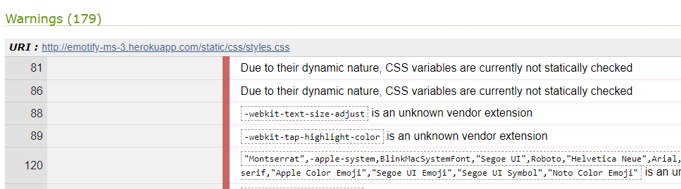
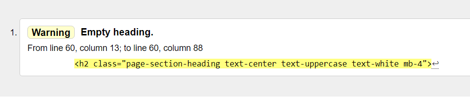
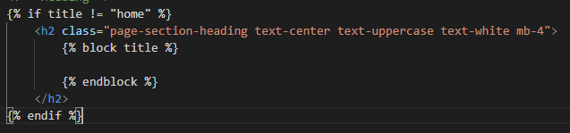
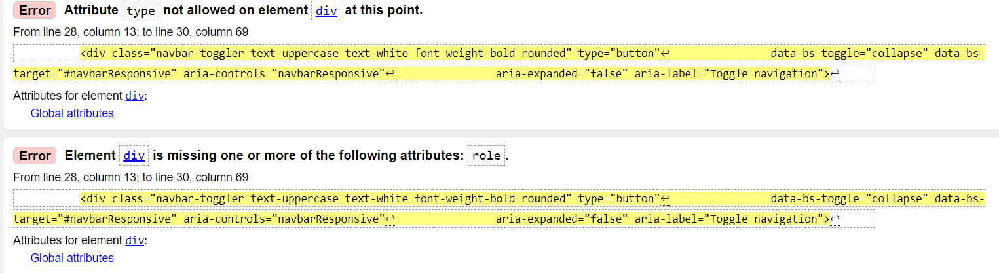
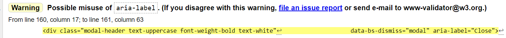
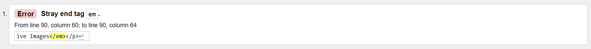
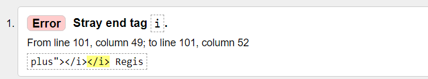
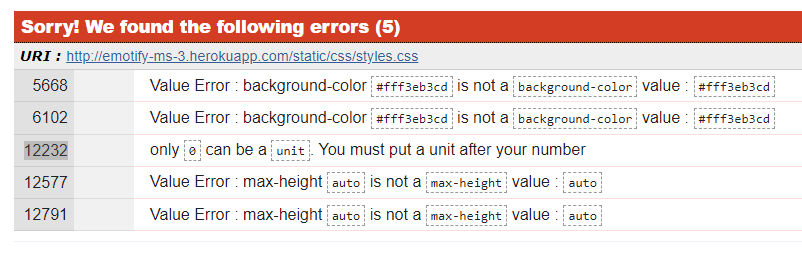

## **TESTING**

### Table of contents
1. [W3C Validation](#Validation)
1. [User Stories Testing](#User-Stories-Testing)
1. [Responsive Design Test](#Site-Responsive-design-test)
1. [CRUD Test](#CRUD)
1. [Testing Forms and validation](Testing-Forms-and-validation)
1. [Future Testing](#Future-Testing)
1. [Bugs](#Bugs)
1. [Solved issues or bugs](#Solved-issues-or-bugs)
1. [Back to Readme.md](../README.md)

### **Validation**
  The W3C Markup Validator and W3C CSS Validator Services were used to validate every page of the project to ensure there were no syntax errors in the project.

- W3C Markup Validator
  - [Index Page](../project_files/validation/index.PNG)
  - [About Page](../project_files/validation/about.PNG)
  - [Gallery Page](../project_files/validation/gallery.PNG)
  - [Register Page](../project_files/validation/register.PNG)
  - [Log In Page](../project_files/validation/login.PNG)
  - [Add Post Page](../project_files/validation/add_post.PNG)
  - [Edit Post Page](../project_files/validation/edit_post.PNG)
  - [My Posts Page](../project_files/validation/mu_posts.PNG)
  - [Account Page](../project_files/validation/account.PNG)
  - [User Posts Admin Page](../project_files/validation/user_posts_admin.PNG)
  - [Manage User Post Page](../project_files/validation/manage_post.PNG)
  - [Admin Page](../project_files/validation/mange.PNG)
- W3C CSS Validation
  - [W3C CSS Validator](../project_files/validation/css.PNG)

- PEP8 requirements

  PEP-8, check is Python's style for naming conventions and coding standards formatting.
  - pep8online [result](../project_files/validation/pep8-views.PNG)

- Jshint

  JSHint, tool that detects errors and potential problems in JavaScript code
  - Result [here](../project_files/validation/jsHint.PNG)

# [&#8686;](#Testing)
[Back to Readme.md](../README.md)
## ***UX*** 
### **User Stories Testing**
#### User goals
- &#10003; The site is fully responsive and is accessable on various devices such us mobile, tablet or pc.
- &#10003; Home Page and About page offers short but clear description for user to understand What is the main purpose of the site.
- &#10003; Site navigation links enables user to easily navigate throughout the site to find desired content.
- &#10003; Social media links are presented in the footer for user.
- &#10003; User is able to get in contact on social media if any questions or bugs.

#### As Registered user
- &#10003; User is able to, create their own account, Login and Logout.
- &#10003; User is able to, Create, read, update and delete their content.
- &#10003; User is able to, Find people with similar interests and mindsets.
- &#10003; User is able to, edit post content and delete content if needed.
- &#10003; User is able to, change password and delete user account.

#### As an Administrator
- &#10003; Administrator is able to, monitor, update and delete user content if necessary.
- &#10003; Administrator is able to, manage user access by deleteting user account if necessary.

#### Site owner goals
- &#10003; The site provides users with online content sharing platform.
- &#10003; The Site provides visitor/user with good user experience.
- &#10003; The Site provides user with site navigation and content search options.
- &#10003; The Site provides registered users to quickly and easily share their content.
- &#10003; The Site provides users with social media links for options if any questions or bugs.

# [&#8686;](#Testing)
[Back to Readme.md](../README.md)

### Site Responsive design test
The Website is fully responsive and will cover most of the devices (screen sizes) and resolutions with minimum width of 330px.

Below i have attached testing gif video for each page tested.
- Index Page [GIF](responsive/index.gif)
- Gallery Page [GIF](responsive/gallery.gif)
- About Page [GIF](responsive/about.gif)
- User Interface
  - My Posts Page [GIF](responsive/my-posts.gif)
  - Account Page [GIF](responsive/account.gif)
- Admin Interface
  - Admin Manage user posts Page[GIF](responsive/manage-post.gif)
  - Admin manage Page [GIF](responsive/manage.gif)

# [&#8686;](#Testing)
[Back to Readme.md](../README.md)

### CRUD 
(create, read, update, and delete) Test
- Create
  - &#10003; Create Post
    1. Get user input title and descriptions from form fields.
    1. Get File input and upoad it to the Cloudinary API.
    1. Upload image file to the Cloudinary API.
    1. inserts a single document into a Mongo Db Posts collection.
  - &#10003; Create User
    1. Get user input from the username and password input fields.
    1. inserts a single document into a Mongo Db Users collection.
- Read
  - &#10003; Read Post
    1. Get Data by Post id and extract all the post data.
    1. Get Cloudinary image URL and display in the galley.
    1. Display correct post title and description in the Gallery.
    1. We are able to Search using keyword, username or by category.
  - &#10003; Read User
    1. User is able to Log into the site by username and password.
    1. Compare username and password HASH match in the Mongo DB.
    1. Able to display users posts in the profile page finding data by username.
- Update
  - &#10003; Update Post
    1. Find existing post by id and get category.
    1. Update mongo existing post's Title and description.
    1. Create DB object for Update Update a document into a posts collection.
  - &#10003; Update User Password
    1. User is able to change their Password by providing old passwodr and new password.
    1. Create new HASHed password and Update DB Users collection document.
- Delete
  - &#10003; Delete Post
    1. Able to Find post in Mongo DB extract image id And delete the post.
    1. Delete a single asset From Cloudinary API dy image id.
  - &#10003;  Delete User
    1. Get user input Username and password, find user in Mongo DB.
    1. Check if username exists in db and ensure hashed password matches and Delete.
    1. Admin is able to delete any existing user by Providing and confirming admin Password.

### Testing Forms and validation
- &#10003; Login form
  - username field:
    Validation regex allow all alphanumeric characters, underscore no spaces allowed.
    Input required, and with length of minimum 4 and maximum 15 charters
  paswword field:
    All characters allowed, Input is required Minimum of 5 and maximum 10 charters.
- &#10003; Register form
  1. username field:
    Validation regex allow all alphanumeric characters, underscore no spaces allowed.
      Input required, and with length of minimum 4 and maximum 15 charters
  1. paswword field:
      All characters allowed, Input is required Minimum of 5 and maximum 10 charters
  1. Confirm Password
    Validation equal to confirm password required
- &#10003; Upload post
  1. Title field: 
      Validation regex allow all alphanumeric characters, underscore, hyphen, multiple spaces allowed.
      Input required, and with length of minimum 3 and maximum 20 charters
  1. Text Area field: 
      Validation all characters alowed, Input required,
      With length of minimum 20 and maximum 500 charters
  1. File upload field: 
    	Validation File Required, files allowed 'png', 'jpg', 'jpeg', 'HEIC', 'RAW', 'HEVC', 'gif'.
- &#10003; Update Post
  1. Title field:
      Validation regex allow all alphanumeric characters, underscore, hyphen, multiple spaces allowed.
      Input required, and with length of minimum 3 and maximum 20 charters
  1. Text Area field: 
      Validation all characters alowed, Input required,
      With length of minimum 20 and maximum 500 charters
- &#10003; Update Password
  1. Old paswword field:
    All characters allowed, Input is required Minimum of 5 and maximum 10 charters
  1. New paswword field:
    All characters allowed, Input is required Minimum of 5 and maximum 10 charters
  1. Confirm Password:
    Validation equal to confirm password required
- &#10003; Delete Account
  1. paswword field:
    All characters allowed, Input is required Minimum of 5 and maximum 10 charters
  1. Confirm Password:
    Validation equal to confirm password required
- &#10003; Update Post Admn
  1. Title field: 
      Validation regex allow all alphanumeric characters, underscore, hyphen, multiple spaces allowed.
      Input required, and with length of minimum 3 and maximum 20 charters
  1. Text Area field: 
      Validation all characters alowed, Input required,
      With length of minimum 20 and maximum 500 charters
- &#10003; Delete User Admin
  1. Paswword field:
    All characters allowed, Input is required Minimum of 5 and maximum 10 charters
  1. Confirm Password:
    Validation equal to confirm password required
- &#10003; Update Admin Password
  1. Old paswword field:
    All characters allowed, Input is required Minimum of 5 and maximum 10 charters
  1. New paswword field:
    All characters allowed, Input is required Minimum of 5 and maximum 10 charters
  1. Confirm Password:
    Validation equal to confirm password required

### **Future Testing**
I have tested the app on a variety of browsers such as  Chrome, Opera, Microsoft Edge, and Firefox desktop version browsers and Huawei p30 Pro chrome and android browser.

I have used Chrome DevTools to Test a variety of devices such as Desktop, Laptop, iPhone7, iPhone 8 & iPhone X for responsive design.

Friends and family members helped point out any bugs or issues.

# [&#8686;](#Testing)
[Back to Readme.md](../README.md)
### **Bugs**
Bootstrap Starter Teplate static css file warnings are unsolved.

# [&#8686;](#Testing)
[Back to Readme.md](../README.md)
### **Solved issues or bugs**
1. Testing form validation revealed an issue with initially set Title max lenght of 10 charters and description max lenght of 200 charters, was not enough. I have adjusted title lenght to 20 charters and 500 charters for description.
1. Friend had an issue uploading image using iPhone, unsupported image file. I was able to fix this by adding 'HEIC', 'RAW', 'HEVC' file extenstions to supported list in WTForms validation.
1. Empty Flask block extension title "h2" tag for Index page. to solve issue, I have Added if stetement to not include heading in index Page.

1. Index page navbar toggler as div gives an error. To solve this issue, I have changed "div" tag into "button" tag.

1. Gallery page button as div gives a warning. To solve this issue, I have addet "role=Button" attribute to the "div" element.

1. About page "em" tag has no opening. To solve this issue, I have removed tag altogether.

1. Register page "i" tag has extra closing tags. To solve this issue, I have removed extra tag.

1. CSS errors. I was able to fih them by changing to correct values.

# [&#8686;](#Testing)
[Back to Readme.md](../README.md)